# Save a Chat Widget Transcript to a Hubspot CRM Contact Using Webhooks

This tutorial will explore how to make a chat widget that connects to the HubSpot CRM to (1) create or update a HubSpot CRM Contact with the user’s info, and (2) save chat transcripts in HubSpot. We’ll use the versatile [Stream Chat](https://getstream.io/chat/) client and its webhooks to accomplish this. The steps provided here will help you learn how to leverage webhooks to interact with HubSpot CRM, based on any events within your chat widget. 

## Overview:

- Open a free Stream account and configure an API key
- Configure a HubSpot CRM account to connect to the HubSpot API
- Build a backend that
   1. Creates or updates the user’s info to a HubSpot CRM Contact
   2. Starts a frontend chat widget using Stream
   3. Opens a private chat channel for the user and a sales representative
   4. Sends data back to the frontend for the user to join the chat channel
   5. Logs all messages in the chat channel to the HubSpot CRM using webhooks

The code for this app can be found in the [Git Repo here](https://github.com/isaidspaghetti/stream-hubspot-chat-transcript). If you'd like to follow along, make sure you're using a relatively recent version of [node.js](https://docs.npmjs.com/downloading-and-installing-node-js-and-npm), run the configuration steps below, then run the following terminal commands in the `frontend` and `backend` directories:

```bash
npm install
npm run start
``` 

Once running, navigate to `http://localhost:3000` to see the `frontend`.


## Read this tutorial if you want to...

- Learn how to use webhooks
- Build a support/sales style chat widget
- Create HubSpot contacts and message logs based on your chat widget
- Create HubSpot and Stream accounts and get API Keys
- Set up a frontend/backend Stream Chat app
- Create a Chat Widget that automatically saves the chat log in HubSpot CRM (using Stream Chat's webhook)
- Set up a private, Frontend/Backend Stream Chat

These topics will be covered using Express JS and React, but the methodologies can be ported to most languages and frameworks.

### What's not covered

- This tutorial focuses on the mechanics of setting up the backend of a chat widget to connect to and update HubSpot. Specifics on creating the React frontend will not be the priority.
- The GitHub repo for this project includes a fully functional registration form and frontend for Stream Chat, but not every aspect will be covered in depth.

## Step 1: Account set up

To get up and running, perform the following steps:

* Clone the [git repo](https://github.com/isaidspaghetti/stream-hubspot-chat-transcript)
* Set up a free Stream Account and configure an API Key and Secret
* Set up HubSpot and configure your HubSpot API Key
* Set `chat_transcript` as a custom contact property field in HubSpot
* Add your unique keys to a `.env` file

### Set-up your Stream account

1. Sign up for a [Stream Trial](https://getstream.io/get_started).

1. Then to generate a Stream API Key and API Secret, navigate to your [Stream.io Dashboard](https://getstream.io/dashboard/). 

    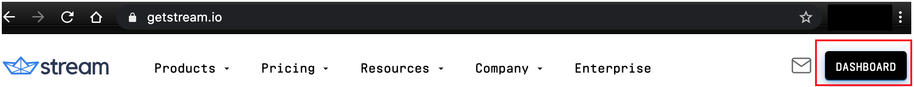

2. Then click on "Create App."

    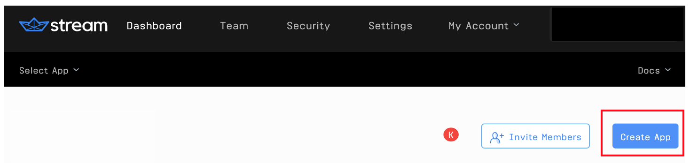

3. Give your app a name, select "Development" and click "Submit". 
 
    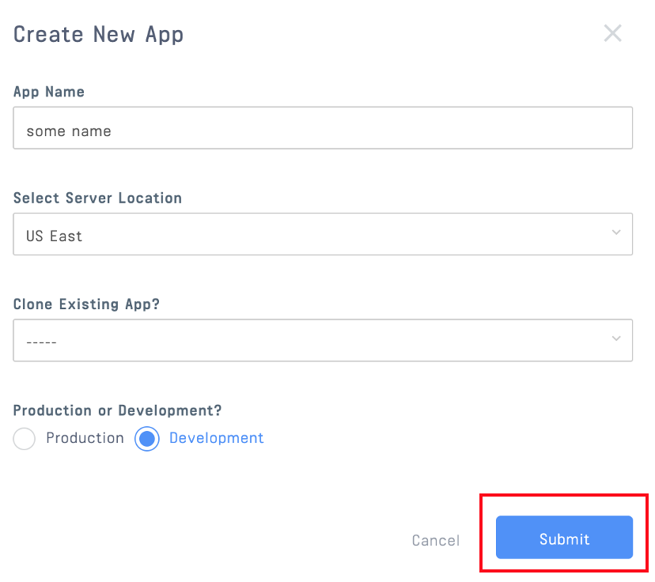

4. Stream will generate a Key and Secret for your app. You need to copy these into your `.env` file.
 
    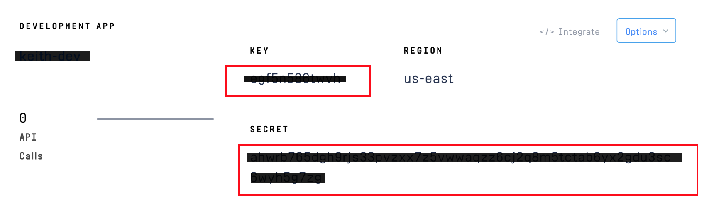

* Set up a free HubSpot Account and configure an API Key there, as well

### Set-up your HubSpot account

1. Create your account at [HubSpot](https://app.hubspot.com/signup/crm/step/user-info?hubs_signup-cta=getstarted-crm&hubs_signup-url=www.hubspot.com%2Fproducts%2Fget-started) and complete the registration form.

2. Once you are logged into the `HubSpot Dashboard,` go to Settings in the upper-right corner.

    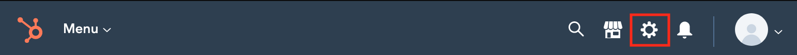

3. Navigate to Integrations > API Key, and create a key. If you're a robot, stop here. You've gone too far...

    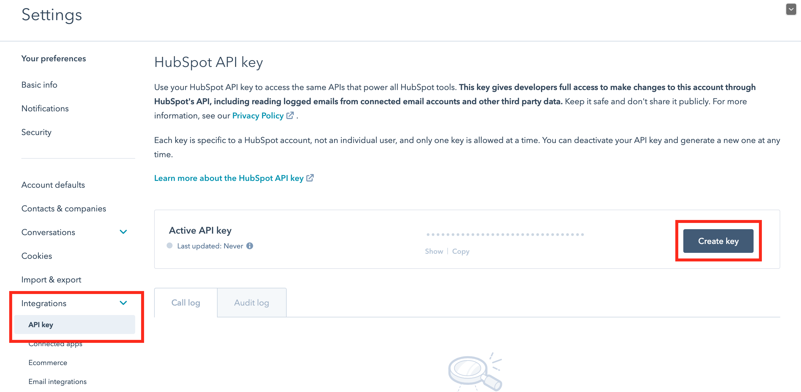

4. Copy the HubSpot API key and paste it in the `.env`

Your HubSpot account can now be accessed through this API key.

### Create a custom HubSpot property for a chat transcript

To save the chat transcript, we will use a custom property field in HubSpot. Here's how to add a custom property to your HubSpot CRM:

1. Navigate to your contacts:

    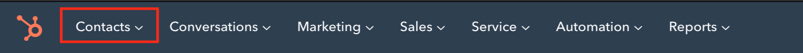

2. Click the 'Actions' drop down menu, then 'Edit Properties':

    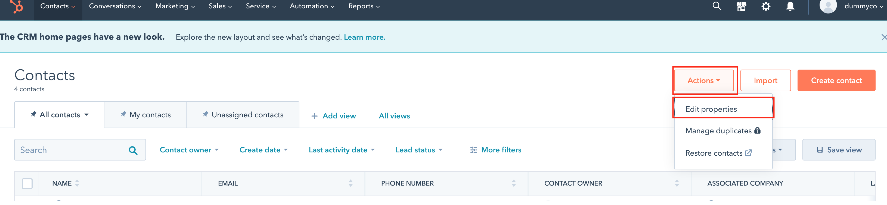

3. Click the 'Create Property' button and add whatever type of custom fields you'd like to use. You want to set the `Field Type` to `multi-line text`.

    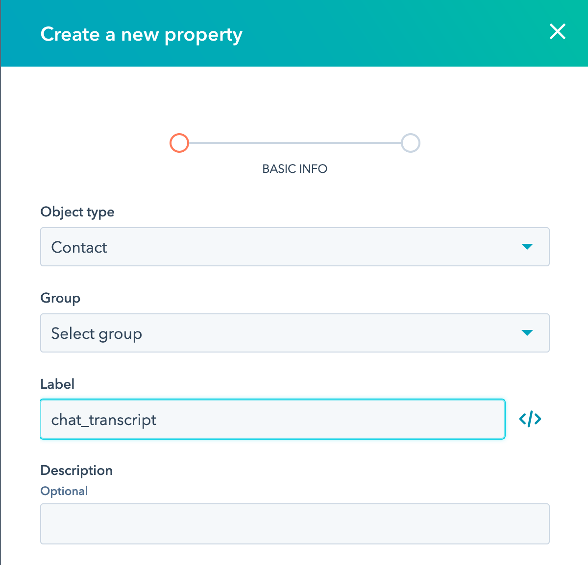

### Set your local environment variables

1. Copy the file `.env.example` to your own `.env`. 

2. Add your API keys and secret to `.env`.

    <!-- "https://gist.github.com/isaidspaghetti/8213b3090e60efae3af44bebfedcc05f.js" -->
    ```text
    //backend/.env
    NODE_ENV=development
    PORT=8080

    STREAM_API_KEY= your Stream API key here
    STREAM_API_SECRET= your Stream API secret here
    HUBSPOT_API_KEY=your HubSpot API key here
    ```

## Step 2: Webhook Setup

### What are webhooks?

If you’re new to [webhooks](https://zapier.com/blog/what-are-webhooks/), here’s a quick explanation of how they work. Webhooks are like push notifications between apps. Before webhooks, backend services had to poll one another to react to updates or changes. The concept of pushing events came along and the responsibility was inverted. Instead of polling, the consuming service simply waits to be notified of an event. The event producing app is configured to send an HTTP POST, containing the event's data, to the specified URL. The consumer listens and processes events at that URL. Stream’s webhooks can alert your app about anything that happens in a Stream Chat. This tutorial's app uses Stream’s webhooks to push new messages to our backend, and our backend uses that information appropriately.

### Setting up a Stream webhook

Stream offers a lot of depth and versatility in its webhooks. To start using them, let's first tell the Stream where to send webhook events. Stream’s webhooks require a publicly routable URL to communicate with. This project runs off a `localhost`, so we need to somehow make our localhost address accessible. We’ll use [ngrok](https://gist.github.com/wosephjeber/aa174fb851dfe87e644e) to create a secure, temporarily public address for our backend. If you already have a public URL running, you can skip the `ngrok` steps and just set up an endpoint URL there.

### ngrok setup

1. [Register for a free ngrok account](https://dashboard.ngrok.com/get-started/setup) and download the software. If you prefer to use Homebrew to install ngrok, use the following terminal command: `brew cask install ngrok`.

2. Once installed, connect your account using the authtoken provided by ngrok at the [same link as above](https://dashboard.ngrok.com/get-started/setup). Just run `ngrok authtoken your_token_goes_here` in the terminal. 

3. To start ngrok, use the terminal command: `ngrok http 8080`: which tells ngrok to serve publicly whatever you are serving locally at http://localhost:8080.   

4. The terminal opens the ngrok app (screenshot below) and shows the public URLs. 

    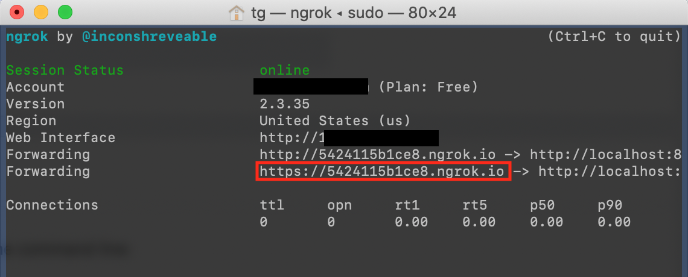

Now, whatever is hosted at `localhost:8080` can receive HTTP requests at this URL. (The URL boxed in red is the publicly available URL).

#### Quick detour: How ngrok works

A very brief overview of how the ngrok app works:

1. ngrok sets up a random, public URL on its servers. This URL can receive HTTP requests (eg: webhooks).

2. ngrok opens an SSH connection with your local machine.

3. Requests to the ngrok public URL get proxied through an SSH tunnel to your local machine.

4. Run your backend as you normally would, through any port (eg: localhost:8080).

5. ngrok receives the SSH request, translates it back to a local HTTP request, and sends it to your app a the specified port.

6. The local app runs as it normally would, sending a response to port 8080.

7. ngrok receives responses from your app and sends the responses back to the ngrok server via SSH

### Configure your webhook URL in Stream

Use the following steps to register your ngrok (or other public URL) with the Stream API:

1. Navigate to [getstream.io](https://getstream.io/) and click the "Dashboard" button on the upper right:

    

2. Once in the dashboard, click your app name:

    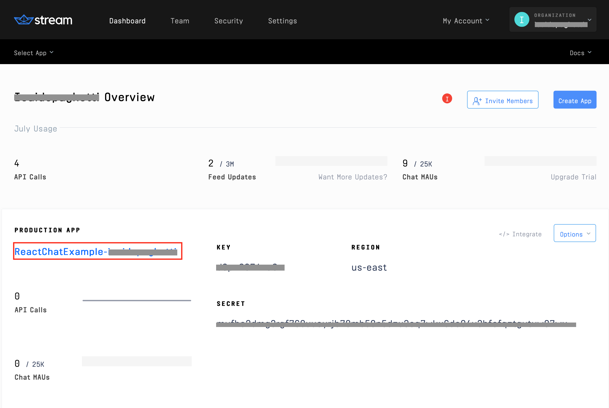

3. Next, from the navbar select the `chat` dropdown and select `Chat Overview`

    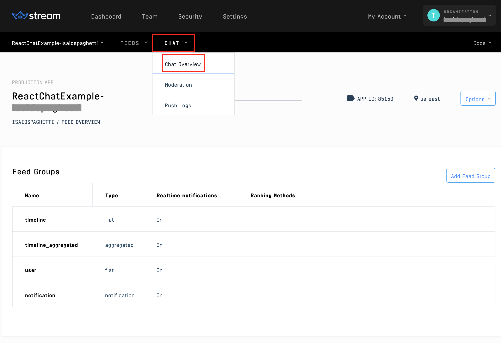

4. Scroll down to the `Chat Events` box. Select the following options: `Webhook: active`, `Disable Auth Checks`, and `Disable Permissions Checks`. (Note that these options are important to consider using if using this app in a production environment). We'll create a `/webhooks` handler in our backend, so just add your public ngrok URL and `/webhooks` to the webhook URL textbox. Save your settings.

    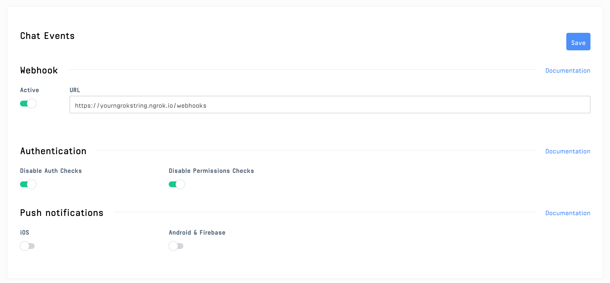

The Stream API will now send a `POST` to that URL anytime an event takes place in your Stream App, with details about the event. The next step is to accept that webhook in our app's backend.

## Step 3: Registration endpoint

Before we can handle a user's chat event, we need to register them in both Stream and HubSpot. The backend file `backend/routes/index.js` is the core of this app. Let's take a peek at the important initialization steps

<!-- https://gist.github.com/isaidspaghetti/cbaa29b7501daeab04b382e4c08c746c -->
```javascript
//backend/routes/index.js:3
const { StreamChat } = require('stream-chat');
const { default: axios } = require('axios');

const apiKey = process.env.STREAM_API_KEY;
const apiSecret = process.env.STREAM_API_SECRET;
const hubspotKey = process.env.HUBSPOT_API_KEY;
```

The `stream-chat` library is the all-in-one chat creator, which handles all the heavy lifting of for our chat portion of the app. `axios` will be used to perform external HTTP requests to HubSpot. Finally, several of our methods will use the `.env` variables, so we call them out at the top for readability.

### Registration: Start a chat

`index.js` contains two endpoints: one for registering a user, and one for receiving webhooks. The registration endpoint is responsible for:

1. Accepting the user's frontend form input
2. Creating a HubSpot customer entry
3. Initializing a Stream chat client
4. Registering the user and support admin with Stream
5. Creating a Stream chat channel

Here's the primary registration endpoint, which we will be breaking down step by step.

<!--- https://gist.github.com/isaidspaghetti/6607b462523a183e6ea5ca8839796afe -->
```javascript
//backend/routes/index.js:46
router.post('/registrations', async (req, res) => {
  try {
    const firstName = req.body.firstName.replace(/\s/g, '_');
    const lastName = req.body.lastName.replace(/\s/g, '_');
    const email = req.body.email.toLowerCase();
    const hubspotContactId = await createHubspotContact(firstName, lastName, email);

    const client = new StreamChat(apiKey, apiSecret);

    [customer, admin] = createUsers(firstName, lastName);

    await client.upsertUsers([
      customer,
      admin
    ]);

    const channel = client.channel('messaging', hubspotContactId, {
      members: [customer.id, admin.id],
    });

    const customerToken = client.createToken(customer.id);

    res.status(200).json({
      customerId: customer.id,
      customerToken,
      channelId: channel.id,
      apiKey,
    });

  } catch (err) {
    console.error(err);
    res.status(500).json({ error: err.message });
  }
});
```

### Registration: Create a contact in the HubSpot API

First, the name inputs are normalized by replacing spaces with '_', and the email is converted to lower case. These values will be stored in HubSpot, so having uniform styling makes it easier to call them when needed. Next, a separate method, `createHubspotContact()` is called to connect to the HubSpot API and create a new contact in the CRM.

<!-- https://gist.github.com/isaidspaghetti/cd9633bb18c48f66845b5059f2613c96 -->
```javascript
//backend/routes/index.js:10
async function createHubspotContact(firstName, lastName, email) {
  let hubspotContact;
  try {
    hubspotContact = await axios.get(`https://api.hubapi.com/crm/v3/objects/contacts/${email}/?idProperty=email&hapikey=${hubspotKey}`);
  }
  catch {
    hubspotContact = await axios.post(`https://api.hubapi.com/crm/v3/objects/contacts?hapikey=${hubspotKey}`,
      {
        properties: {
          'firstname': firstName,
          'lastname': lastName,
          'email': email,
        }
      }
    );
  }

  return hubspotContact.data.id;
}
```

Axios is used to first check our HubSpot CRM for an existing contact with the email submitted on the front end. If not, a `catch` is used to create it. Take note that this use of `catch` is agressive, since there are many ways the `try` could fail. This implementation keeps things simple, but make sure you have good error handling in your production applications.

Within the `catch`, we use axios to `POST` the frontend user's inputs to HubSpot's endpoint. The secret `hubspotKey` is passed to let HubSpot know (1) which account to add the contact to, and (2) that the request is legitimate. The properties passed can match any HubSpot contact property, including custom properties. This method returns HubSpot's unique contact id, which will be helpful later in our webhook. 

### Registration: Create a client and users

Once the contact is created, we instantiate a Stream client bypassing our unique Stream API Key and Stream Secret. 

<!-- https://gist.github.com/isaidspaghetti/8880d717e46cbd6374cb18260e18caa2 -->
```javascript
//backend/routes/index.js:53
const client = new StreamChat(apiKey, apiSecret);
```

To allow our chat users to join, they will first need to be registered with Stream. For this app, only the frontend user and a customer support user are required.

The `createUsers` method creates the users in Stream, with optional properties to control each user's permissions. The method accepts the user inputs to create the `customer` object and creates a generic `admin` user to represent a technical or sales representative on the other end of the chat. 

<!-- https://gist.github.com/isaidspaghetti/f52f81d86037fdfae957d6ac9466a40d -->
```javascript
//backend/routes/index.js:30
function createUsers(firstName, lastName) {
  const customer = {
    id: `${firstName}-${lastName}`.toLowerCase(),
    name: firstName,
    role: 'user',
  };

  const admin = {
    id: 'admin-id',
    name: 'Support Admin',
    role: 'admin'
  };

  return [customer, admin];
}
```

There are other ways to create users in Stream, but this technique illustrates some of Stream's flexibility in doing so. User objects only require an `id`, but Stream offers a handful of built-in [property options](https://getstream.io/chat/docs/init_and_users/?language=js), and accepts any custom property you want to make. 

Back in the registration handler, the user objects are passed to `upsertUsers`, which registers the users with the client.

<!-- https://gist.github.com/isaidspaghetti/1633debaa3e84c7b032867583c6f9e21 -->
```javascript
//backend/routes/index.js:57
await client.upsertUsers([
  customer,
  admin
]);
```

### Registration: Create a channel

Next, the `/registrations` handler starts a Stream channel. Stream's `channel()` method accepts parameters: `('type', 'id', {channel-data})`. Our app uses: 

<!-- https://gist.github.com/isaidspaghetti/badda0914bb53f4ebab1035c91ef5171 -->
```javascript
//backend/routes/index.js:62
const channel = client.channel('messaging', hubspotCustomerId, {
  members: [customer.id, admin.id],
});
```

There are several different [channel types](https://getstream.io/chat/docs/channel_features/?language=js), which are customizable. For this session, we'll just use `'messaging'`. 

Here we use the HubSpot record, `hubspotCustomerId` as our channel id so we can look this up easily in our webhook. In a production application, you'd likely want to store this information in a database; however, here we choose to keep it simple by just leveraging the channel id to persist this information.

The third argument commands that only users with Stream user ids matching `customer.id` or `admin.id` are allowed to enter this channel.

### Registration: Respond to the frontend

Last, but not least: we create a `customerToken` and respond to the frontend of the application with all the data needed to join the chat we have created. 

<!-- https://gist.github.com/isaidspaghetti/9bbe75e44657e2201c951bd2cf426c61 -->
```javascript
//backend/routes/index.js:66
const customerToken = client.createToken(customer.id);
```

At this point, the frontend code has everything it needs to start a chat session. We won't touch on the frontend code in this post. It follows a similar process as the backend. Feel free to check out the source code if you're curious. To learn more check out [this example](https://getstream.io/blog/how-to-capture-leads-from-live-chat-in-hubspot/).


## Step 4: Webhook handler

The `backend/routes/index.js` file also contains the `/webhooks` endpoint. Here is the process flow of this endpoint: 

1. Receive a request from the Stream webhook service.
2. If the webhook is initiated by a new message event (`message.new`), continue, otherwise do nothing.
3. Use `axios` to retrieve any existing chat transcript from HubSpot.
4. Append the new message to the previous transcript record.
5. Use `axios` to update the custom `chat_transcript` HubSpot contact property.

And here's the code:

<!-- https://gist.github.com/isaidspaghetti/9b6ab4ab1d38850853ab05e1d04975c6 -->
```javascript
//backend/routes/index.js:81
router.post('/webhooks', async (req, res) => {
  if (req.body.type === 'message.new') {
    try {
      const newMessage = req.body.message;
      const hubspotContactId = req.body.channel_id;
      let updatedTranscript;

      const customerResponse = await axios
        .get(`https://api.hubapi.com/crm/v3/objects/contacts/${hubspotContactId}`, {
          params: {
            properties: 'chat_transcript',
            archived: false,
            hapikey: hubspotKey,
          }
        });
      let localTranscript = customerResponse.data.properties.chat_transcript;
      if (!localTranscript) { localTranscript = ""; }
      updatedTranscript = `${localTranscript}\n FROM: ${newMessage.user.id}\n SENT AT: ${newMessage.created_at}\n MESSAGE: ${newMessage.text}`;

      await axios
        .patch(`https://api.hubapi.com/crm/v3/objects/contacts/${hubspotContactId}?hapikey=${hubspotKey}`, {
          properties: {
            'chat_transcript': updatedTranscript,
          }
        });
    } catch (err) {
      res.status(200).end();
    }
  }

  res.status(200).end();
});
```

Let's break down the handler above. Stream's webhook sends an HTTP POST request to this handler anytime an event occurs in our app. We only want to update `chat_transcript` when a new message is sent, so we add an `if` `then` to execute this function only when `message.new` is the webhook initiator. Stream offers over twenty [webhook initiators](https://getstream.io/chat/docs/webhook_events/?language=js). 

HubSpot's API has plenty of [useful endpoints](https://developers.hubspot.com/docs/api/crm/contacts) as well. We just need to call two of them. The first call is to retrieve any existing chat transcript saved in HubSpot. We previously set the Stream Chat channel id to match the HubSpot contact id, making this lookup much easier. We specify the exact contact we want to check by including the `hubspotCustomerId` and ask for just their chat transcript using `chat_transcript` as a parameter.

Note that custom contact properties in HubSpot are called using the Label Name shown in the HubSpot property editor window (see below). If you included spaces or dashes in your contact property, use an underscore when referencing it in your request body. 


Line 96 is used to avoid a `null` response if this is the first time the property is being written. The chat transcript can be customized with whatever properties are useful for your application. The string literal used in this example includes the `user.id`, `created_at` date, and message `text`, each of which is included in the Stream webhook request body. To see the available properties provided by the webhook, see [Stream's documentation](https://getstream.io/chat/docs/webhook_events/?language=js#codemessagenewcode).

The second HTTP request is sent to the HubSpot API's contact update URL. The request specifies the property to be updated and what to update it with. Multiple properties can be updated at once if desired. 

Finally, we always respond with a 200. This ensures that our connection with the HubSpot API will be closed when our task is done, even if our code fails. Some webhook integrations might flag your app for repeated timeouts or non-200 status code responses.

Here's the final result:

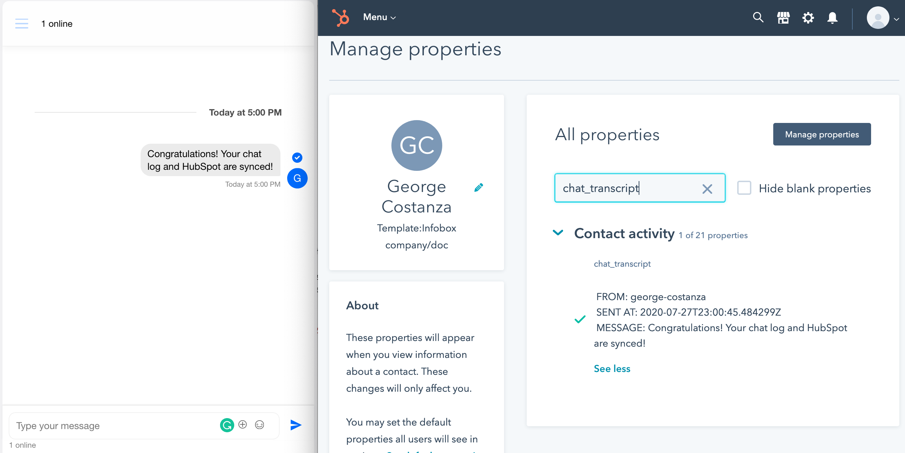

## Closing thoughts

What may sound like a daunting task can be done quite artfully when using the right tools for the job. In this case, the right tools are a chat app with webhooks (Stream), and tactful use of HubSpot API endpoints. Hopefully, this post has inspired you creatively and equipped you with skills to make your app tasks easier.